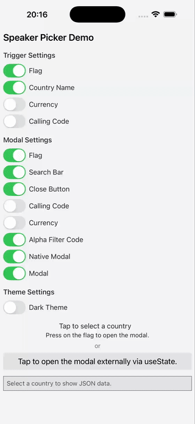

# RN Speaker Picker
A fork of [react-native-country-picker-modal](https://github.com/xcarpentier/react-native-country-picker-modal) with tweaks for use in [MUNctl](https://munctl.app/).

## Tweaks
* Upgraded dependencies
* Add custom countries/speakers at runtime
* Improved alpha filter
* Visual redesign

| iOS                                                        | Android                                                                                          | Web                                                                                               |
|------------------------------------------------------------|--------------------------------------------------------------------------------------------------|---------------------------------------------------------------------------------------------------|
|  |  |  |


## Example

For an example, open [App.tsx](https://github.com/xcarpentier/react-native-country-picker-modal/blob/master/App.tsx)

## Props

- `countryCode`: [CountryCode](https://github.com/xcarpentier/react-native-country-picker-modal/blob/master/src/types.ts#L252)
- `region?`:[Region](https://github.com/xcarpentier/react-native-country-picker-modal/blob/master/src/types.ts#L272)
- `subregion?`: [Subregion](https://github.com/xcarpentier/react-native-country-picker-modal/blob/master/src/types.ts#L282)
- `countryCodes?`: [CountryCode](https://github.com/xcarpentier/react-native-country-picker-modal/blob/master/src/types.ts#L254)
- `theme?`: [Theme](https://github.com/xcarpentier/react-native-country-picker-modal/blob/7611d34fa35744dbec3fbcdd9b4401494b1ba8c4/src/CountryTheme.ts#L5)
- `translation?`: [TranslationLanguageCode](https://github.com/xcarpentier/react-native-country-picker-modal/blob/master/src/types.ts#L309)
- `modalProps?`: [ModalProps](https://facebook.github.io/react-native/docs/modal#props)
- `filterProps?`: [CountryFilterProps](https://facebook.github.io/react-native/docs/textinput#props)
- `flatListProps?`: [FlatListProps<Country>](https://facebook.github.io/react-native/docs/flatlist#props)
- `withAlphaFilter?`: boolean
- `withCallingCode?`: boolean
- `withCurrency?`: boolean
- `withEmoji?`: boolean
- `withCountryNameButton?`: boolean
- `withCurrencyButton?`: boolean
- `withCallingCodeButton?`: boolean
- `withFlagButton?`: boolean
- `withCloseButton?`: boolean
- `withFilter?`: boolean
- `withFlag?`: boolean
- `withModal?`: boolean
- `visible?`: boolean
- `containerButtonStyle?`: `StyleProp<ViewStyle>`
- `renderFlagButton?`(props: (FlagButton['props'])): ReactNode ([FlagButton props](https://github.com/xcarpentier/react-native-country-picker-modal/blob/master/src/FlagButton.tsx#L73))
- `renderCountryFilter?`(props: CountryFilter['props']): ReactNode ([CountryFilter props is TextInputProps](https://facebook.github.io/react-native/docs/textinput#props))
- `onSelect`(country: Country): void ([Country](https://github.com/xcarpentier/react-native-country-picker-modal/blob/master/src/types.ts#L263))
- `onOpen`(): void
- `onClose`(): void
- `closeButtonImage?`: [ImageSourcePropType](https://facebook.github.io/react-native/docs/image#props)
- `closeButtonStyle?`: StyleProp<ViewStyle>
- `closeButtonImageStyle?`: StyleProp<ImageStyle>
- `disableNativeModal?`: boolean (you have to wrap your all app with CountryModalProvider)
- `preferredCountries`: [CountryCode](https://github.com/xcarpentier/react-native-country-picker-modal/blob/master/src/types.ts#L254) preferred countries they appear first (`withAlphaFilter` must be false)

## Dark theme example

<p style="text-align: center">
    
</p>

A simple example to display a `CountryPicker` component with a dark theme.

```tsx
import CountryPicker, { DARK_THEME } from 'react-native-country-picker-modal'

const MyDarkView = () => <CountryPicker theme={DARK_THEME} />
```

## License

[MIT](LICENSE)