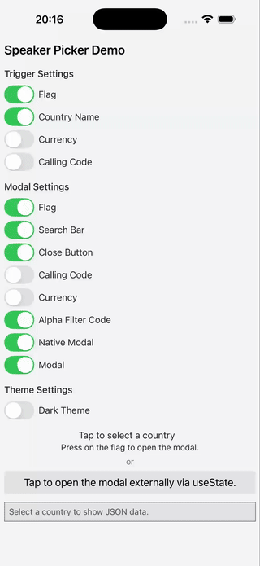

# RN Speaker Picker
A fork of [react-native-country-picker-modal](https://github.com/xcarpentier/react-native-country-picker-modal) with tweaks for use in [MUNctl](https://munctl.app/).

## Testing
- Install dev deps: `pnpm install`
- Run unit and component tests: `pnpm test`
- The Jest setup mocks reanimated, gesture-handler, flash-list, and safe-area-context for React Native components.

## E2E
- Start Expo in one terminal: `pnpm start`
- Launch your simulator/emulator (iOS Simulator or Android Emulator)
- Run Maestro flows: `pnpm e2e:ios` or `pnpm e2e:android`. Make sure you've preinstalled the development builds on the device.
- Flows live in `maestro/main.yaml` and exercise modal open/close, alpha scroll, and search selections.

## Tweaks
* Upgraded dependencies
* Add custom countries/speakers at runtime
* Improved alpha filter
* Visual redesign

## Example

For an example, open [App.tsx](https://github.com/munctl/rn-speaker-picker/blob/master/App.tsx)

## License

[MIT](LICENSE)
